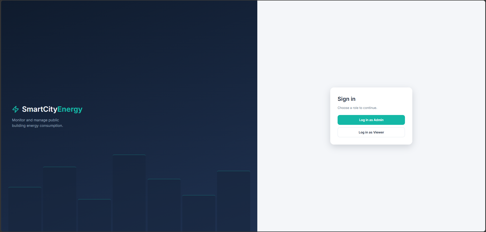
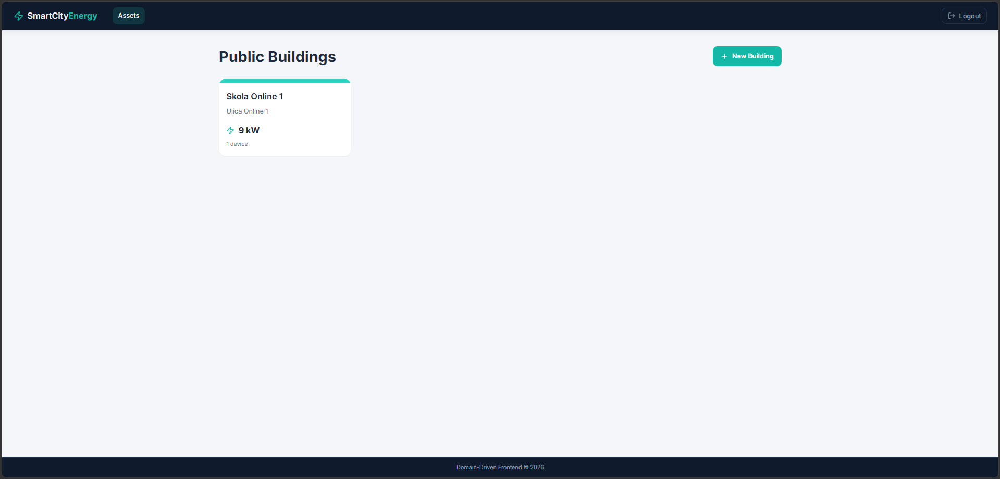
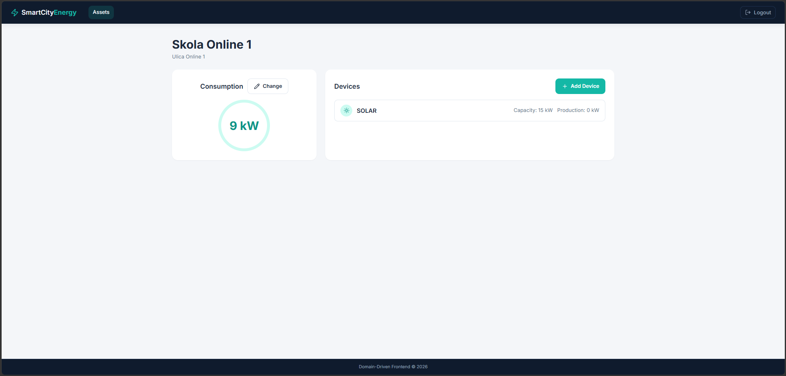

# SmartCity Frontend

[](https://github.com/zaricu22/SmartCity-Frontend/actions/workflows/ci-cd.yml)
[](https://codecov.io/gh/zaricu22/SmartCity-Frontend)
[](https://sonarcloud.io/project/overview?id=zaricu22_SmartCity-Frontend)
[](https://angular.dev)

An Angular 18 single-page application for managing smart city infrastructure — public buildings and their energy devices. Built as an architectural reference for **Domain-Driven Design (DDD) with Onion Architecture** applied to a modern Angular standalone component model.

---

## Live Demo

[https://zaricu22.github.io/SmartCity-Frontend/](https://zaricu22.github.io/SmartCity-Frontend/)

---

## Screenshots





---

## Features

| Screen | What you can do |
|---|---|
| Building list | Browse all public buildings, filter by name, create or delete a building |
| Building detail | View energy consumption, manage energy devices |
| Energy devices | Add solar, wind, battery, or hydro devices with rated capacity |
| Consumption | Update a building's current energy consumption |
| Auth | Login with role-based access control (USER / MANAGER / ADMIN) |

---

## Tech Stack

| | Technology |
|---|---|
| Framework | Angular 18 — standalone components, Signals, `ChangeDetectionStrategy.OnPush` |
| Language | TypeScript 5.5 |
| Reactivity | Angular Signals + RxJS 7.8 |
| Rendering | Angular SSR (Express) |
| HTTP | Angular `HttpClient` with functional interceptors |
| Linting | ESLint + angular-eslint |
| Unit tests | Jest + jest-preset-angular |
| Mutation tests | Stryker (`@stryker-mutator/jest-runner`) — weekly schedule + manual dispatch |
| CI/CD | GitHub Actions → GitHub Pages |
| Security | Gitleaks, Snyk, OWASP Dependency-Check |
| Code quality | SonarCloud, Codecov |

---

## Prerequisites

- **Node.js 20+** — `node --version`
- **npm 9+** — `npm --version`
- **Angular CLI 18** — `npm install -g @angular/cli@18`
- [SmartCity Backend](https://github.com/zaricu22/Domain-Driven-Backend) running on `http://localhost:8080` for local development

---

## Installation & Setup

```bash
git clone https://github.com/zaricu22/SmartCity-Frontend.git
cd SmartCity-Frontend
npm ci
```

Generate the local environment file (run once after cloning):

```bash
npm run setup:env
```

This creates `src/environments/environment.ts` if it does not already exist.

---

## Running Locally

```bash
npm start
```

Open [http://localhost:4200](http://localhost:4200).

---

## Running Tests

**Unit tests:**
```bash
npm test
```

**Unit tests with coverage report:**
```bash
npx jest --coverage
```
Coverage output is written to `coverage/lcov.info`. (`ng test` no longer works — the Karma
builder was removed from `angular.json` when the project migrated to Jest, see ADR-0019.)

**Architecture / DDD layer rules:**
```bash
npm run test:arch
```
Fails if any import crosses a layer boundary the Onion Architecture forbids (e.g. domain
importing from infrastructure). Runs as its own CI job, in parallel with unit tests.

**Mutation tests:**
```bash
npm run test:mutation
```
> Runs Stryker against the domain + application layers only (see ADR-0020). Not part of the
push/PR pipeline — runs on a weekly schedule or manual `workflow_dispatch`, since it re-runs
the suite once per mutant and is too slow for every push.

> **E2E tests:** not implemented — see [ADR-0021](docs/architecture/adr/0021-e2e-testing-not-implemented.md).
Cypress was evaluated and removed; it has no working support for Angular's SSR/hydration
output in this app.

---

## Build for Production

```bash
npm run build
```

Output: `dist/smartcityfront/browser/` (static client bundle) and `dist/smartcityfront/server/`
(SSR Node bundle) — `ssr.entry` + `prerender` in `angular.json` split the build into these two
folders. Only `browser/` is deployed to GitHub Pages.

**Serve the SSR bundle:**
```bash
npm run serve:ssr:smartcityfront
```

---

## Linting

```bash
npm run lint
```

---

## CI/CD Pipeline

Every push and pull request to `dev` or `main` runs the full pipeline on GitHub Actions.

```
Push / PR
    │
    ├─── Security (parallel) ───────────────────────────────────────────┐
    │       ├── Gitleaks          secret scan (JS/TS + env files)       │
    │       ├── CodeQL            SAST for TypeScript/JavaScript        │
    │       ├── Snyk              dependency vulnerability check        │
    │       └── OWASP DC          dependency CVE report (HTML artifact) │
    │                                                                   │
    ├─── Test ◄──────────────────────────────── (needs Security jobs)   │
    │       ├── npx jest --coverage                                     │
    │       └── coverage → Codecov + uploaded for SonarCloud            │
    │                                                                   │
    ├─── Architecture ◄────────────────────────  (needs Security jobs)  │
    │       └── npm run test:arch  (DDD layer-boundary check)           │
    │                                                                   │
    ├─── Code Quality ◄────────────────── (needs Test + Architecture)   │
    │       ├── ESLint                                                  │
    │       └── SonarCloud analysis                                     │
    │                                                                   │
    └─── Release & Deploy ◄──────────── (needs Test + Code Quality)     │
            only on push to main                                        │
            ├── npm run build                                           │
            ├── Semantic Release  (version bump, CHANGELOG, GitHub tag) │
            └── GitHub Pages deploy                                     │
```

| Job | Trigger | Tool |
|---|---|---|
| Secret scan + SAST | all branches | Gitleaks + CodeQL |
| Dependency check | all branches | Snyk + OWASP Dependency-Check |
| Unit tests + coverage | all branches | Jest + Codecov |
| DDD architecture check | all branches | `test:arch` (custom ts-node script) |
| Lint + static analysis | all branches | ESLint + SonarCloud |
| Build + release + deploy | `main` only | Semantic Release + GitHub Pages |

> Mutation testing (`mutation-testing.yml`) is **not** part of this pipeline — it runs weekly or
on manual dispatch instead, since it re-runs the suite once per mutant (see ADR-0020).

Secrets required in the repository settings: `CODECOV_TOKEN`, `SNYK_TOKEN`, `SONAR_TOKEN`, `GH_TOKEN`.

> **GitHub Pages setup:** the deploy job pushes the built client bundle (`dist/smartcityfront/browser/`) to a `gh-pages` branch via `peaceiris/actions-gh-pages`. GitHub Pages must be configured in **Settings → Pages → Source** to serve from that branch, not from `main`. Without this, the deploy job succeeds but nothing is served. After deploy, the pipeline runs a smoke test that polls the live URL every 15 s to confirm the site is actually up.

---

## Environment Variables

Angular uses compile-time environment files under `src/environments/`.

| Variable | Description | Dev | Prod |
|---|---|---|---|
| `production` | Enables Angular production mode | `false` | `true` |
| `apiBaseUrl` | Base URL of the SmartCity Backend REST API | `http://localhost:8080` | `https://smartcity-backend-9g09.onrender.com/SmartCityREST` |

Edit `src/environments/environment.ts` for local overrides.
**Do not commit secrets or private API keys to these files.**

---

## API Connection

Connects to the [SmartCity Backend](https://github.com/zaricu22/Domain-Driven-Backend) REST API.

Base URL is configured via `environment.apiBaseUrl`. Every request carries a `Bearer` JWT token attached by the `AuthInterceptor`.

> **Production backend is on Render's free tier and sleeps after inactivity.** The first request
after a period of no traffic can take up to 5 minutes to wake it up — a slow or timed-out first
call against [https://smartcity-backend-9g09.onrender.com](https://smartcity-backend-9g09.onrender.com) is expected, not a bug. Subsequent
requests respond normally once it's awake.

| Method | Path | Description |
|---|---|---|
| `POST` | `/auth/login` | Authenticate, receive JWT |
| `GET` | `/v1/buildings/all` | List all buildings |
| `GET` | `/v1/buildings/:id` | Get building by ID |
| `POST` | `/v1/buildings` | Create building |
| `DELETE` | `/v1/buildings/:id` | Delete building |
| `POST` | `/v1/buildings/:id/devices` | Add energy device |
| `PUT` | `/v1/buildings/:id/consumption` | Update consumption |

---

## Folder Structure

```
src/app/
├── asset/                        # Bounded context: buildings & energy devices
│   ├── domain/                   # Aggregate root, entities, value objects, events, specs
│   │   ├── aggregate/             #   PublicBuilding
│   │   ├── entity/                #   EnergyDevice
│   │   ├── value-object/          #   Energy (immutable, kW/MW/GW conversion)
│   │   ├── event/                 #   DeviceAddedEvent, ConsumptionChangedEvent, ProductionChangedEvent
│   │   ├── exception/             #   DomainException, DeviceNotFoundException, ...
│   │   ├── specification/         #   SubsidyEligibilitySpecification
│   │   ├── shared/enums/          #   DeviceType, EnergyUnit, ErrorCode
│   │   └── repository/            #   PublicBuildingRepository (port/interface)
│   ├── application/              # Use cases, commands, DTOs, facade
│   │   ├── service/               #   AppService (writes), QueryService (reads)
│   │   ├── facade/                 #   PublicBuildingFacade — single entry point for UI
│   │   ├── command/               #   CreateBuilding, AddDevice, ChangeConsumption, ChangeProduction
│   │   ├── dto/                   #   Flat DTOs consumed by presentation layer
│   │   ├── mapper/                 #   BuildingDtoMapper (domain → DTO)
│   │   ├── exception/              #   ApplicationException
│   │   └── shared/enums/           #   DeviceType, EnergyUnit — presentation-facing copies (see ADR-0011)
│   ├── infrastructure/           # HTTP/WebSocket adapters, ACL mappers, request/response models
│   │   ├── api/
│   │   │   ├── service/           #   PublicBuildingApiService (implements repository)
│   │   │   ├── mapper/            #   BuildingResponseMapper (response → domain)
│   │   │   ├── response/          #   HTTP response types
│   │   │   └── request/           #   HTTP request body types
│   │   └── websocket/             #   BuildingWebsocketService (infra exists, not yet wired to EventBus)
│   └── presentation/             # Angular pages, components, dialogs, lazy routes
│       ├── page/                  #   BuildingListComponent, BuildingDetailComponent — route targets
│       ├── component/             #   BuildingCard, DeviceList, EnergyDisplay — embedded in pages
│       ├── dialog/                #   CreateBuildingDialog, AddDeviceDialog, ChangeConsumptionDialog — modal overlays
│       └── route/                 #   asset.routes.ts (lazy-loaded)
└── shared/                       # Cross-cutting concerns, no domain logic
    ├── infrastructure/
    │   ├── auth/                  #   AuthService, AuthGuard, UnsavedChangesGuard
    │   ├── interceptor/           #   AuthInterceptor, HttpErrorInterceptor, RequestIdInterceptor
    │   ├── error/                 #   GlobalErrorHandler, AppHttpError
    │   ├── messaging/             #   EventBusService
    │   └── api/                   #   ApiConfig
    └── presentation/
        ├── layout/                 #   Shell, Header, Footer — persistent chrome around RouterOutlet
        ├── page/                   #   Login, Forbidden, NotFound — standalone route targets
        ├── component/              #   Toast, ConfirmDialog, EmptyState — reused across bounded contexts
        ├── pipe/                   #   EnergyPipe
        ├── directive/              #   PositiveNumberDirective
        └── service/                #   ToastService, ConfirmDialogService
```

### Presentation Layer Organization

Every `presentation/` folder (both `asset/` and `shared/`) follows the same four-way split:

| Folder | What goes here | Examples |
|---|---|---|
| `layout/` | Persistent chrome rendered around `<router-outlet>` on every route | `Shell`, `Header`, `Footer` |
| `page/` | Route-level components — one per route, injects the Facade, owns page state | `BuildingListComponent`, `BuildingDetailComponent`, `LoginComponent` |
| `component/` | Embedded or reusable presentational components — no route of their own | `BuildingCard`, `DeviceList`, `EnergyDisplay`, `Toast`, `EmptyState` |
| `dialog/` | Modal overlays, conditionally rendered (not routed), closed via a result `Observable` (see ADR-0013) | `CreateBuildingDialog`, `AddDeviceDialog`, `ChangeConsumptionDialog` |

`asset/` only has bounded-context-specific pages/components/dialogs; 
`shared/` holds the chrome plus components reused across bounded contexts. 
`pipe/`, `directive/`, `service/` live next to `shared/presentation` because they support presentation but aren't components themselves.

---

